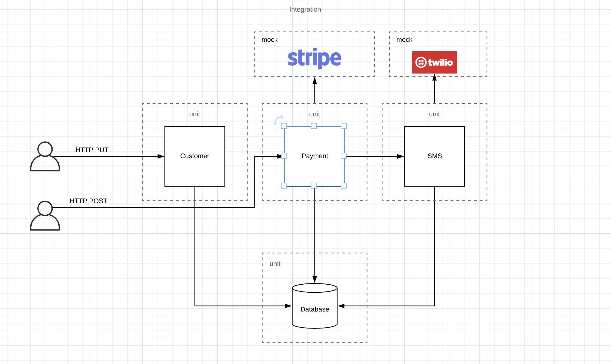

# Stripe-Twillo-Software-Testing-and-Integration

Software Testing is a skill that you must fully grasp as a software engineer. It ensures that any code you write to production is more likely to contain less bugs.

In this project, we covered the following....

Unit Testing
Integration Testing
Testing External Services
Mocking with Mockito
Test Driven Development

Implementing Stripe payment system and Twilio Messaging services.

You will see ta real example code using Stripe and Twilio

We acknowledge learning material from @Amigsocode software and testing course.

# UML MODEL | Architecture Diagram

